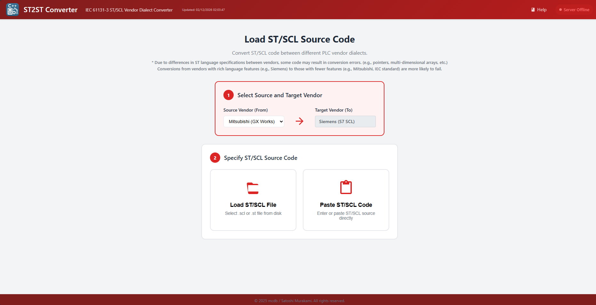
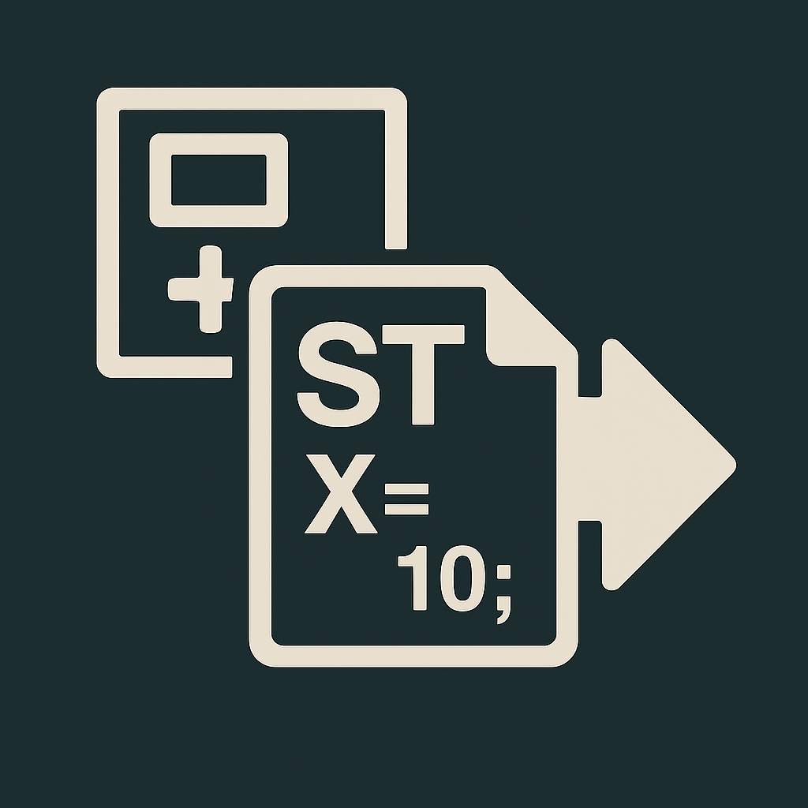
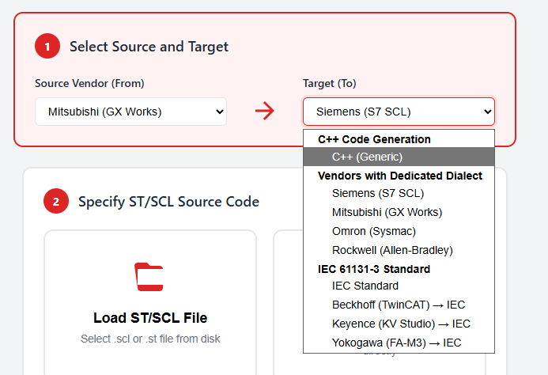

#  ST Code Converter

## 📖 The Story Behind This Tool

As a high-level language software engineer, I cannot write PLC ladder logic. Beyond the architectural differences, I simply had no desire to learn vendor-locked code that can only be used in highly restricted environments.

So, I decided to take a different approach: *"Why not build a modern software controller where control logic can be written entirely in high-level languages?"* This led me to develop **[OCA (Object-oriented Control Architecture)](https://github.com/mcdbcherry/oca_release)**.

It all started with an attempt to import existing PLC code into OCA by adding a feature to convert Structured Text (ST) into C++. The robust conversion mechanism I implemented turned out to be capable of not only converting ST to C++, but also translating ST code between different PLC vendors.

This software is the standalone ST conversion engine, extracted directly from the OCA framework.

---

This tool converts Structured Text (ST) code used by various PLC vendors into ST code for other vendors, or into high-level programming languages. 
Unlike simple regex-based string replacements, this conversion is powered by a robust and advanced parsing architecture.

## 📦 Requirements

To use this tool, you need the following software installed on your system:
- **Python**
- **Microsoft Visual C++ Redistributable**

## 🚀 Getting Started

### How to Use
1. Run the included `start_server.bat` file. This will launch a simple Python web server in the background.
2. Open `index.html` in your preferred web browser.

### How to Close
1. Close the ST Code Converter page in your web browser.
2. Close the Command Prompt window running the Python web server.

## ⚙️ Specifications

- **Scope of Conversion:** The converter processes ST code at the **function level**. 
  - *Note:* Code that defines data types in ST (a format adopted by certain vendors) is not supported and will not be converted.
- **System Calls:** Vendor-specific system calls are retained using their original function names. A comment will be automatically appended to these lines, indicating that the specific feature requires manual re-implementation in the target environment.
- **Processing Limit:** You can convert exactly **one function** per execution.
- **Conversion Limitations based on Language Specs:** Conversions from vendors with rich ST language specifications (e.g., Siemens, Rockwell, Omron) to vendors with more limited specifications (e.g., Mitsubishi, IEC Standard) may not always succeed due to missing equivalent language features.

## ⚠️ Important Notes

- **Beta Testing Limitations:** Currently, it is difficult to obtain testable ST code in the wild, which means our actual conversion testing is limited. **Please expect bugs and unexpected behaviors.**
- **Not a Silver Bullet:** This tool does not guarantee a 100% perfect, ready-to-run conversion to the target vendor's code. Manual adjustments will likely be required.
- **Clean Room Implementation:** The parsing and conversion logic is implemented strictly based on publicly available ST specifications provided by the respective vendors. **No confidential, proprietary, or trade secret information is included in this tool.**

## 🤝 Contributing & Feedback

We need your help to improve the converter's accuracy! 

- **Report Bugs:** If you discover a problem, please open an **Issue**. We will review and address them sequentially to improve the tool.
- **Share Failed Conversions:** If you encounter ST code that did not convert correctly, please share the snippet in an **Issue** so we can analyze and enhance the underlying engine.

---

## ⚠️ License & Proprietary Notice

**Copyright (c) 2016-2026 Satoshi Murakami. All Rights Reserved.**

This source code and related documentation are the **proprietary property** of Satoshi Murakami.
Unauthorized copying, distribution, modification, or use of this file, via any medium, is strictly prohibited.

* **Asset Acquisition:** For inquiries regarding technology transfer or IP acquisition, please contact the author directly.

**Strictly Confidential.**